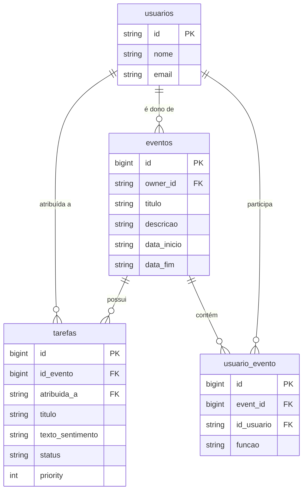

# 📊 Plataforma de Gestão

> Uma solução robusta e escalável para o gerenciamento e controle de processos corporativos, combinando uma API REST de alta performance com uma interface de usuário moderna e responsiva.

---

## 📌 Índice

- [Sobre o Projeto](#-sobre-o-projeto)
- [Tecnologias Utilizadas](#%EF%B8%8F-tecnologias-utilizadas)
- [Arquitetura e Recursos](#%EF%B8%8F-arquitetura-e-recursos)
- [Como Executar o Projeto](#-como-executar-o-projeto)
  - [Pré-requisitos](#pré-requisitos)
  - [Configuração do Backend](#1-configuração-do-backend-laravel)
  - [Configuração do Frontend](#2-configuração-do-frontend-react)
- [Executando os Testes](#-executando-os-testes)
- [Estrutura do banco de dados](#-estrutura-do-banco-de-dados)
- [Estrutura de Variáveis de Ambiente](#-estrutura-de-variáveis-de-ambiente)
- [Autor](#-autor)

---

## 💻 Sobre o Projeto

A **Plataforma de Gestão** é um sistema completo desenvolvido para otimizar fluxos de trabalho, centralizar dados operacionais e fornecer relatórios estratégicos. O projeto foi construído separando as responsabilidades de negócio (Backend isolado em uma API RESTful) e a experiência de usuário (Frontend SPA com React).

## 🛠️ Tecnologias Utilizadas

O ecossistema do projeto é composto pelas seguintes tecnologias:

* **Backend:** [Laravel](https://laravel.com/) (Framework PHP)
* **Frontend:** [React](https://react.dev/) (Biblioteca JavaScript para interfaces)
* **Banco de Dados:** [PostgreSQL](https://www.postgresql.org/) (Banco relacional avançado)
* **Autenticação:** JWT (JSON Web Tokens) para comunicação stateless e segura
* **Gerenciador de Pacotes:** [Composer](https://getcomposer.org/) (PHP) & [NPM](https://www.npmjs.com/) ou [Yarn](https://yarnpkg.com/) (JavaScript)
* **Suíte de Testes:** PHPUnit (Testes automatizados e de integração no Backend)

---

## ⚙️ Arquitetura e Recursos

* **Autenticação Stateless:** Controle de sessão e rotas protegidas utilizando JWT, garantindo que cada requisição entre o React e o Laravel seja autenticada de forma segura através de headers HTTP.
* **API RESTful:** Endpoints padronizados em JSON para todas as operações de CRUD da plataforma de gestão.
* **Banco de Dados Relacional:** Modelagem de dados otimizada tirando proveito dos recursos avançados de indexação e integridade do PostgreSQL.
* **Testes Automatizados:** Cobertura de funcionalidades críticas e fluxos de negócio usando PHPUnit para garantir a estabilidade do ecossistema.

---

## 🚀 Como Executar o Projeto

### Pré-requisitos
Antes de iniciar, certifique-se de ter instalado em sua máquina:
* PHP (v8.1 ou superior)
* Composer
* Node.js (v18 ou superior) e gerenciador NPM/Yarn
* Serviço do PostgreSQL ativo

---

### 1. Configuração do Backend (Laravel)

```bash
# Clone o repositório e acesse a pasta do backend
$git clone [https://github.com/seu-usuario/seu-repositorio.git$](https://github.com/seu-usuario/seu-repositorio.git$) cd seu-repositorio/backend

# Instale as dependências do PHP via Composer
$ composer install

# Crie o arquivo de configuração local
$ cp .env.example .env

# Gere a chave criptográfica do Laravel
$python -c "import secrets; print(secrets.token_hex(16))" # Ou use o comando nativo:$ php artisan key:generate

# Configure o JWT Secret (dependendo do pacote utilizado, ex: tymon/jwt-auth)
$ php artisan jwt:secret

# Crie o banco de dados no PostgreSQL e execute as migrações/seeds
$ php artisan migrate --seed

# Inicie o servidor embutido do Laravel
$ php artisan serve
````
### 2. Configuração do Frontend (React)

```bash
# Navegue até a pasta do frontend
$ cd ../frontend

# Instale as dependências do ecossistema JavaScript
$ npm install  # ou yarn install

# Crie o arquivo de ambiente para o Frontend e aponte para a URL do Laravel
$ cp .env.example .env

# Inicie a aplicação em modo de desenvolvimento
$ npm run dev  # ou yarn start
````

## 🧪 Executando os Testes
Para garantir o correto funcionamento das regras de negócio do backend e evitar regressões, execute as suítes de testes com o PHPUnit:

```bash
# Na pasta raiz do backend:
./vendor/bin/phpunit

# Ou utilizando o comando auxiliar do Laravel:
php artisan test
```
## Estrutura do Banco de dados




## 🔒 Estrutura de Variáveis de Ambiente
### 1.Configurações de Banco de Dados (backend/.env)
```bash
DB_CONNECTION=pgsql
DB_HOST=127.0.0.1
DB_PORT=5432
DB_DATABASE=nome_do_seu_banco
DB_USERNAME=seu_usuario_postgres
DB_PASSWORD=sua_senha_postgres
```
### 2. Configurações da API no Cliente (frontend/.env)
```bash
# Altere de acordo com o endereço onde o servidor Laravel está rodando
VITE_API_URL=http://localhost:8000/api
```

## 👤 Autor
Desenvolvido por GuilermeTyper — Sinta-se à vontade para entrar em contato!


